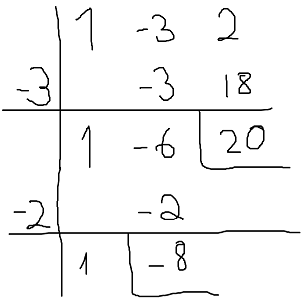

# Fórmula de Abel e do quociente
[[toc]]
Exemplo:

$$\sum_{k=1}^{n-1}\frac{(k-2)(k-1)}{(k+1)(k+2)(k+3)}$$

De início não parece ser possível haver uma resolução direta devido ao que se tem no numerador. Em exercícios deste tipo usa-se o que se chama **o método das pontas**, que consiste em eliminar os fatores mais exteriores do denominador. Por exemplo:

$$(k-2)(k-1)=k^2-3k+2$$

Queremos transformar isto nalgo que tenha fatores, por exemplo, $(k+3)$ (poderia ser $k+1$). Aplica-se então o método de Horner/Ruffini a este polinómio, dividindo por $(k+3)(k+2)$:

$$\longrightarrow 1\cdot(k+3)(k+2)-8(k+3)+20$$

e o somatório original vem como:

$$\sum_{k=1}^{n-1}\frac{(k+3)(k+2)}{(k+1)(k+2)(k+3)} -\\ 8\sum_{k=1}^{n-1}\frac{(k+3)}{(k+1)(k+2)(k+3)}+\\20\sum_{k=1}^{n-1}\frac{1}{(k+1)(k+2)(k+3)} =\\

\sum_{k=1}^{n-1}\Delta H_k + \left[\frac{8}{k+1}-\frac{10}{(k+1)(k+2)}\right]_1^n = \\

H_n-1+\frac{8}{n+1}-4-\frac{10}{(n+1)(n+2)} + \frac 5 3$$

## Fórmula de Abel

Pretende-se estudar a diferença finita de expressões do tipo $u_n v_n$:

tem-se:

$$\Delta(u_nv_n)=u_{n+1}v_{n+1}-u_nv_n =\\
u_{n+1}v_{n+1} + \underline{u_nv_{n+1} -u_nv_{n+1}} - u_nv_n = \\
v_{n+1}(u_{n+1}-u_n)+u_n(v_{n+1}-v_n) = \\
v_{n+1}\Delta u_n + u_n\Delta v_n \longrightarrow \\
\\
\huge{u_n\Delta v_n = \Delta(u_nv_n) - v_{n+1}\Delta u_n}$$

Pelo que se pode aplicar facilmente:

$$\sum_{k=0}^{\textbf{n-1}}u_k\Delta v_k = [u_kv_k]_0^\textbf{n} - \sum_{k=0}^{n-1}v_{n+1}\Delta u_n$$

Exemplo:

$$\sum_{k=0}^{n-1}kH_k = \sum_{k=0}^{n-1}H_k\Delta\frac{k^{\underline{2}}}{2} = \left[\frac{k^{\underline{2}}}{2}H_k\right]_0^n - \sum_{k=0}^{n-1}\left(\frac{k(k+1)}2\cdot\frac{1}{k+1}\right)$$

## Diferença finita do quociente

$$\Delta \frac{u_n}{v_n} = \frac{u_{n+1}}{v_{n+1}} - \frac{u_n}{v_n} = \\

\frac{u_{n+1}v_n+\underline{u_nv_n-u_nv_n} -u_nv_{n+1}}{v_nv_{n+1}} = \\

\huge\frac{(\Delta u_n)v_n -u_n\Delta v_n}{v_nv_{n+1}}$$

## Exemplos

$$\sum_{k=0}^{n-1}\frac{k2^k}{(k+1)(k+2)} = \quad ?$$

Repare-se:

$$\Delta\frac{2^k}{k+1} = \frac{2^k(k+1)-2^k(1)}{(k+1)(k+2)}=\frac{k2^k}{(k+1)(k+2)}$$

logo:

$$\sum_{k=0}^{n-1}\frac{k2^k}{(k+1)(k+2)} = \sum_{k=0}^{n-1}\Delta\frac{2^k}{k+1} = \left[\frac{2^k}{k+1}\right]_0^n =\frac{2^{n}}{n+1} -1 $$

Outro exemplo:

$$\sum_{k=0}^{n-1}\frac{k2^k}{(k+2)!} = \quad ?$$

Repara-se:

$$ 
\Delta\frac{2^k}{(k+1)!} = \frac{2^k(k+1)!-2^k(k+1)(k+1)!}{(k+2)!(k+3)!} =\\\frac{2^k-2^k(k+1)}{(k+2)!} = \frac{2^k(1-k-1)}{(k+2)!}= -\frac{k2^k}{(k+1)(k+2)}$$

Outro exemplo:

$$\sum_{k=0}^{n-1}\frac{2k-1}{2^{k-1}} = \quad ?$$

Repara-se:

$$\Delta\frac{ak+b}{2^{k-1}} = \frac{a2^{k-1}-(ak+b)2^{k-1}}{2^{k-1}2^{k}}= \frac{a-(ak+b)}{2^{k}} = \frac{-\frac a 2k+\frac{a-b} 2}{2^{k-1}}$$

$$\begin{dcases}-\frac a 2 = 2\\\frac{a-b} 2 = -1\end{dcases} \Leftrightarrow  \begin{dcases}a=4\\b = -2\end{dcases} $$

logo

$$\Delta \frac{-4k-2}{2^{k-1}} = \frac{2k-1}{2^{k-1}}$$